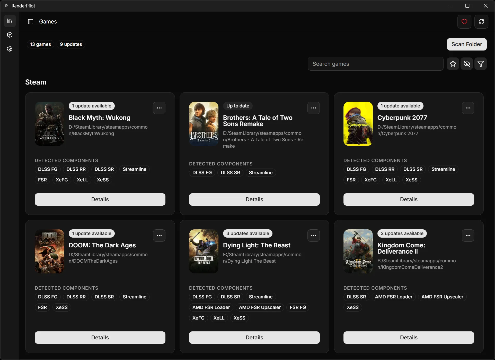
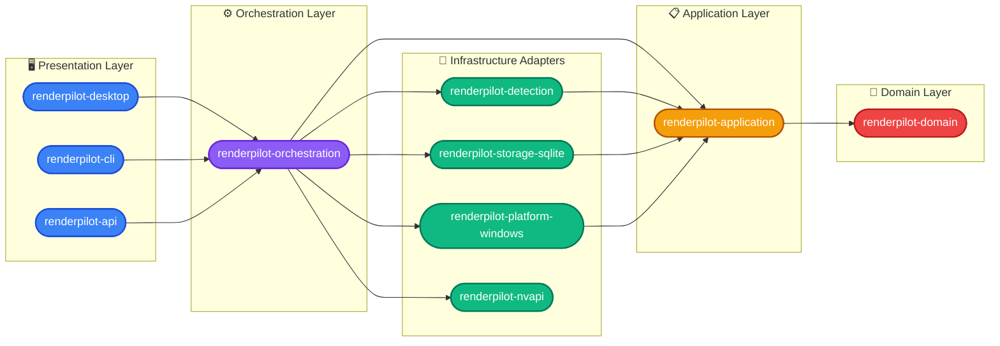

<div align="center">
  

  <h1>RenderPilot</h1>

  <p><strong>Manage, update, and swap PC game rendering libraries — DLSS, FSR, XeSS and more — from a single interface.</strong></p>

  <div>
    <a href="https://boosty.to/osyka.yuri/donate"></a>
    
  </div>

  <div style="margin-top: 10px;">
    
    
    
    
  </div>
</div>

<br />

<div align="center">
  
</div>

RenderPilot automatically scans your installed games, identifies which upscaler libraries they use, and lets you upgrade, downgrade, or swap them in one click. All processing happens locally — no telemetry, no cloud accounts required.

## ✨ Features

- **🔍 Automatic Game Detection:** Scans your system (Steam, Epic, GOG, EA App, Ubisoft Connect, or any custom folder) and recognizes DLSS, FSR, XeSS, DirectStorage, and related libraries across all detected titles.
- **🔄 One-Click Library Management:** Upgrade to the latest version or roll back to a previous one without touching game files manually.
- **📦 Centralized Catalog:** Browse available library versions pulled from a continuously updated manifest.
- **🛡️ Safe Rollback:** Original files are backed up before any modification — restore any game to its original state at any time.
- **💾 Local-First:** Everything stored in a local SQLite database. Fast, private, and fully offline-capable.
- **⚡ Native Performance:** Built on Tauri and Rust — tiny binary, instant startup, minimal memory footprint.
- **🎮 Game Covers & Artwork:** Automatically fetch game covers from SteamGridDB or set custom artwork from your files.
- **🔧 NVIDIA Driver-Level Settings:** Manage the full range of DLSS Super Resolution, Frame Generation, and Ray Reconstruction driver settings (including presets) per game via NVAPI.
- **📟 DLSS Indicator Overlay:** Toggle the built-in NVIDIA DLSS indicator to see which upscaler version is active in real-time.
- **🏷️ Advanced Game Filtering:** Filter by library or launcher, search by name, mark favorites, hide games — organize your catalog your way.
- **📋 Operation Journal:** Review every library swap and rollback in a detailed history log.
- **💻 CLI Tool:** Automate library management from the terminal — scan, compare candidates, plan and apply swaps, rollback, and audit your game library.
- **🎨 Theme Support:** Light, dark, and system-following themes with persistent preference.
- **🔄 App Updater:** Built-in update mechanism to keep RenderPilot current.

## 🛠️ Supported Technologies

|                                                            Vendor                                                            | Technologies                                                                         |
| :--------------------------------------------------------------------------------------------------------------------------: | :----------------------------------------------------------------------------------- |
|           | DLSS Super Resolution · Frame Generation · Ray Reconstruction · Streamline           |
|                    | FSR (Upscaler, Loader, Radiance Cache) · FSR Frame Generation · FSR Ray Regeneration |
|              | XeSS · XeFG · Xe Low Latency                                                         |
|  | DirectStorage                                                                        |

**Supported Launchers:** Steam, Epic Games Store, GOG, EA App, Ubisoft Connect — plus any manual folder you choose.

## 🚀 Getting Started

### Prerequisites

- [Rust](https://www.rust-lang.org/tools/install) (minimum 1.85, pinned via `rust-toolchain.toml`)
- [Node.js](https://nodejs.org/) v20+
- [pnpm](https://pnpm.io/installation)
- Windows C++ Build Tools and WebView2 Runtime

### Build from Source

**Desktop app:**

```bash
git clone https://github.com/osyka-yuri/renderpilot.git
cd renderpilot/apps/desktop
pnpm install
pnpm tauri dev
```

**CLI tool:**

```bash
cargo build -p renderpilot-cli
./target/debug/renderpilot --help
```

## 🏗️ Architecture

RenderPilot follows a **hexagonal (ports & adapters) architecture** in Rust with a Svelte 5 frontend, organized as a Cargo workspace.

> **Note on naming:** `renderpilot-api` is a **GUI presentation facade** (driving adapter), not the application layer. It converts typed orchestration results into JSON for the frontend. The actual **Application** layer is `renderpilot-application`, which defines port traits and use cases.



### Crates

| Crate                                      | Layer                              | Purpose                                                                                                                                                                           |
| :----------------------------------------- | :--------------------------------- | :-------------------------------------------------------------------------------------------------------------------------------------------------------------------------------- |
| `renderpilot-domain`                       | **Core**                           | Pure domain types — enums (`GraphicsTechnology`, `ComponentKind`), validated IDs (`GameId`, `ComponentId`), value objects (`Version`, `PathRef`). Minimal deps (`serde`, `sha2`). |
| `renderpilot-application`                  | **Application**                    | Use cases, port traits (`ComponentDetector`, `GameSourceProvider`, `*Repository`), persistence records, operation planning, candidate matching.                                   |
| `renderpilot-detection`                    | **Adapter**                        | Filesystem scanner — PE version parsing, glob-based library pattern matching against a bundled JSON catalog. Implements `ComponentDetector`.                                      |
| `renderpilot-storage-sqlite`               | **Adapter**                        | SQLite persistence — implements all `*Repository` traits. Atomic scan writes, WAL mode, schema migrations.                                                                        |
| `renderpilot-platform-windows`             | **Adapter**                        | Windows platform — Steam install discovery, manual folder scanning, executable detection, Windows Registry helpers, DLSS indicator toggle. Implements `GameSourceProvider`.       |
| `renderpilot-nvapi`                        | **Adapter**                        | NVAPI FFI bindings via runtime `libloading` — reads/writes NVIDIA Driver Settings (DRS profiles). Gracefully degrades on non-NVIDIA hardware.                                     |
| `renderpilot-orchestration`                | **Orchestration**                  | Wires ports to adapters. Owns all heavyweight dependencies (`reqwest`, `zip`, `rusqlite`). Feature modules: catalog, covers, DLSS, libraries, NVAPI.                              |
| `renderpilot-api`                          | **Presentation** (driving adapter) | GUI facade for the desktop frontend — converts typed orchestration results to `serde_json::Value`. Also serves `rp-cover://` URIs for game cover images.                          |
| `renderpilot-cli`                          | **Presentation**                   | Binary (`renderpilot`) — arg parsing, JSON/text output, manifest generation.                                                                                                      |
| `renderpilot-desktop` (in `apps/desktop/`) | **Shell**                          | Tauri 2 desktop app — 31 IPC command handlers, UAC elevation, portable mode, updater.                                                                                             |

### Frontend

The Svelte 5 frontend lives in `apps/desktop/` with source under `ui/src/` and follows **Feature-Sliced Design**:

```
ui/src/
  app/          — Shell, navigation, routes, global app model
  pages/        — Full screens: games catalog, game details, libraries, operations, settings
  features/     — Use cases: scan, swap, covers, NVAPI settings, filters, updater
  entities/     — Business entities: game, component, library, operation, settings
  widgets/      — Composable UI: games grid, header, notifications, settings panels
  shared/       — UI primitives, i18n (7 locales: en, ru, es, fr, de, zh, ja), theme, validators
```

Powered by Svelte 5 runes (`$state`, `$derived`, `$effect`), Tailwind CSS 4, bits-ui, Lucide icons, `@tanstack/svelte-virtual`, and `@tauri-apps/api` for IPC. Tested with Vitest.

### Key Decisions

- **Stable string enums** — `stable_enum!` macro generates synchronized `serde::Deserialize`/`Serialize`, `Display`, and `FromStr` for every enum.
- **Validation at boundaries** — IDs, paths, and versions are validated on construction; invalid domain state is unrepresentable.
- **Error propagation chain** — `AppError` → `ServiceError` → `ApiError` → `CommandError`, each layer adding context.
- **Atomic scan writes** — game + components + artifacts persisted in a single SQLite transaction.
- **Portable mode** — `RENDERPILOT_APP_DIR` env var + `portable` feature stores all data in `<exe_dir>/data/`.
- **UAC elevation** — automatic self-relaunch with admin rights for NVAPI write access, with sentinel to prevent infinite loops.

## 📄 License

Licensed under the [GNU General Public License v3.0](LICENSE.txt).

## ☕ Support

**If RenderPilot saves you time, consider supporting its development:**

<a href="https://boosty.to/osyka.yuri/donate"></a>
