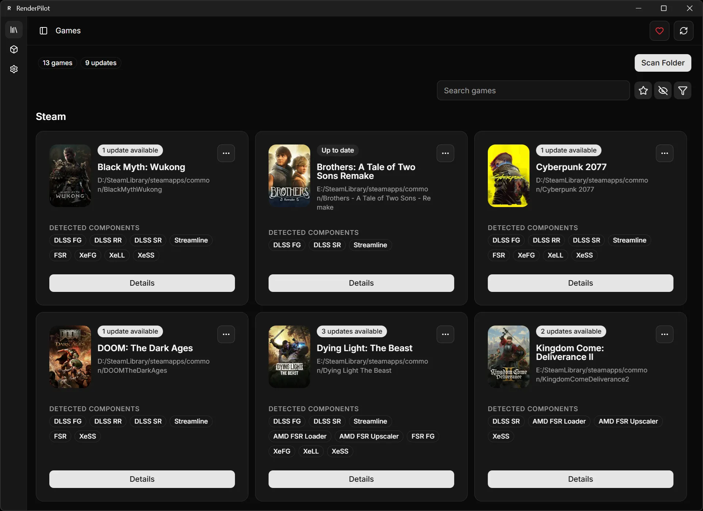

  
  <h1>RenderPilot</h1>
  
<strong>Keep PC game rendering libraries current, compatible, and reversible from one Windows app.</strong>

  
RenderPilot finds supported games, shows the rendering components they use, and helps you update, downgrade, or restore them without manually working through game folders.

  <h3><a href="https://github.com/osyka-yuri/renderpilot/releases/latest">Download for Windows</a></h3>
  

    <a href="https://github.com/osyka-yuri/renderpilot/releases/latest">Portable build</a>
    · <a href="https://github.com/osyka-yuri/renderpilot/releases">All releases</a>
  

  

    
    
    
  

  
Official downloads are published only through GitHub Releases.

## What RenderPilot does

RenderPilot brings the rendering libraries used by your games into one focused catalog. It is useful when you want newer upscaling or frame-generation components, need to return to a known-working version, or simply want a clear view of what is installed.

- **Finds your games.** Scan supported launchers, add your own folders, and keep manually installed titles in the same library.
- **Manages rendering components.** Review DLSS, FSR, XeSS, DirectStorage, D3D12, OpenVR, Ogg/Vorbis, and other supported libraries without hunting for individual files.
- **Updates, downgrades, and restores.** Choose an available version, review the planned changes, and return to the original files when needed.
- **Supports RenoDX and Luma.** Install, inspect, update, or remove supported add-ons for HDR, upscaling, and shader features.
- **Controls NVIDIA DLSS settings.** Adjust supported Super Resolution, Frame Generation, and Ray Reconstruction settings for individual games.
- **Keeps your library local.** No account is required, and RenderPilot does not collect telemetry.

RenoDX, Luma, ReShade, and the libraries managed by RenderPilot are independent third-party projects. Their licenses, compatibility requirements, and risks still apply; RenderPilot does not replace their documentation or guarantees.

## How it works

1. **Scan games.** Let RenderPilot inspect supported launcher libraries, or select a folder yourself.
2. **Review changes.** Compare the installed state with compatible choices and see which files an operation will affect.
3. **Update or restore.** Apply the selected change, or roll the game back to its saved original files.

RenderPilot checks the game again immediately before changing it. Clear operations can proceed directly; ambiguous, stale, or higher-risk situations stop for review or require explicit confirmation. You stay in control of the game root, executable, selected version, and add-on actions.

## Safety and privacy

Rendering-library changes can affect whether a game starts, how it renders, or whether online protections accept its files. RenderPilot is designed to make those changes visible and recoverable.

- Original files are backed up for rollback, and saved backups are verified before they are used.
- The current game state is checked again before a change is applied, so an older plan cannot silently overwrite newer files.
- Interrupted supported operations can be detected and recovered when RenderPilot starts again.
- Game Details keeps one compact safety notice visible for file-changing features. Anti-cheat detection can add context, but no scan result guarantees that modifying a multiplayer game is permitted; see [Game-file safety](docs/user/game-file-safety.md) before applying changes.
- Detection, catalog state, operation history, settings, and backups remain on your computer. RenderPilot has no account system or telemetry.
- A network connection is used only when requesting remote catalogs, libraries or add-ons, artwork, and application updates. Previously cached information remains available when a source cannot be reached.

Read [Data, network access, recovery, and troubleshooting](docs/user/data-and-troubleshooting.md) before changing a sensitive installation.

## Supported ecosystem

| Group | Supported components |
| --- | --- |
| NVIDIA | DLSS Super Resolution, Frame Generation, Ray Reconstruction, Streamline, and per-game DLSS settings |
| AMD | FSR upscaling, Frame Generation, Ray Regeneration, loader, and radiance components |
| Intel | XeSS, XeSS Frame Generation, and Xe Low Latency |
| Other | DirectStorage, Microsoft DXC, D3D12 Agility SDK, OpenVR, and Xiph Ogg/Vorbis |

Launcher discovery supports **Steam, Epic Games, GOG, EA App/Origin, and Ubisoft Connect**. You can also add manual folders, including games installed outside a launcher. Detection and compatibility depend on the files and executable that are present; RenderPilot asks you to review uncertain matches rather than treating every similarly named file as interchangeable.

## Get started

RenderPilot supports **Windows x64** and uses **Microsoft Edge WebView2** for its interface. Current installers require WebView2 runtime version 136.0.3240.44 or later; Windows normally maintains this runtime for you.

The **installer** is the recommended choice. It integrates the app with Windows, supports in-app updates, and offers an explicit data-removal choice during uninstall. Download the installer from the [latest release](https://github.com/osyka-yuri/renderpilot/releases/latest). Windows requests administrator approval before it creates the installed app process; if you decline, RenderPilot does not start or make any changes. After approval, scan your launchers.

The **portable build** is an alternative for keeping the executable and RenderPilot data together in one folder. Extract the complete ZIP before starting it. Windows requires administrator approval before it creates the portable supervisor process; if you decline, no RenderPilot process starts and portable state remains unopened. The portable build does not turn managed game changes into portable files.

See the [installation guide](docs/user/installation.md) for WebView2, Windows launch authorization, updates, portable storage, and uninstall behavior. Continue with the [user guide](docs/README.md#user-guide) for scanning, version management, add-ons, NVIDIA settings, artwork, and recovery.

## Documentation and project

- [User guide](docs/README.md#user-guide) — installation, game discovery, safe library operations, add-ons, settings, and troubleshooting.
- [Developer documentation](docs/README.md#developer-guide) — workspace setup, architecture, storage, contracts, localization, quality gates, and releases.
- [Advanced CLI](docs/development/cli.md) — a source-only maintenance and diagnostics tool; no standalone CLI binary is published.
- [Contributing](CONTRIBUTING.md) — the shortest path from a local checkout to a reviewable change.
- [Issues](https://github.com/osyka-yuri/renderpilot/issues) and [changelog](CHANGELOG.md) — report problems and review release history.
- [Support development on Boosty](https://boosty.to/osyka.yuri/donate) — an optional way to support the project.
- [GNU GPLv3 license](LICENSE.txt) — terms for using, modifying, and distributing RenderPilot.

For installation and update safety, download RenderPilot only from this repository's GitHub Releases page. Third-party components remain subject to their own licenses and support policies.
