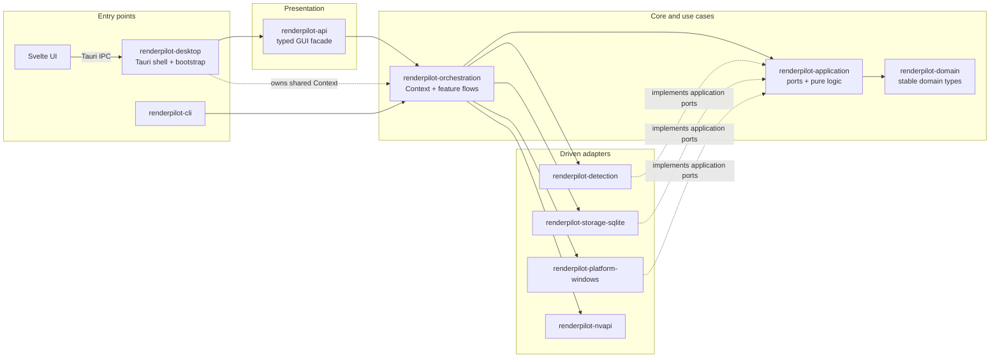

<div align="center">
  

  <h1>RenderPilot</h1>

  <p><strong>Manage, update, and swap PC game rendering libraries — DLSS, FSR, XeSS and more — from a single interface.</strong></p>

  <div>
    <a href="https://boosty.to/osyka.yuri/donate"></a>
    
  </div>

  <div style="margin-top: 10px;">
    
    
    
    
  </div>
</div>

<br />

<div align="center">
  
</div>

RenderPilot automatically scans your installed games, identifies their rendering libraries and runtimes, and lets you upgrade, downgrade, or swap supported packages in one click. It can also install supported rendering add-ons: RenoDX for HDR and Luma Framework for DirectX 11 upscaling, HDR, and shader replacement. All processing happens locally — no telemetry or cloud accounts required.

## ✨ Features

- **🔍 Automatic Game Detection:** Scans your system (Steam, Epic, GOG, EA App, Ubisoft Connect, or any custom folder) and recognizes DLSS, FSR, XeSS, DirectStorage, DXC, D3D12 Agility SDK, OpenVR, and related libraries across all detected titles.
- **🔄 One-Click Library Management:** Upgrade to the latest compatible version, select another available release, or restore the original files without editing game directories manually.
- **🧩 Guarded D3D12 Agility Updates:** Keeps `D3D12Core.dll` and the selected game's `D3D12SDKVersion` in sync. A fresh preflight reports whether the executable needs no change, a managed patch, an original restore, or manual repair. The first managed patch and a user-selected restore require state-bound confirmation; stale or ambiguous game state fails closed.
- **📦 Centralized Catalog:** Browse available library versions and supported add-on profiles pulled from continuously updated manifests.
- **🛡️ Safe Rollback:** Original baselines are captured once, immutable sidecars are SHA-256 verified before use, and a rollback preflight lists every affected path. Interrupted operations are recovered from the durable journal without silently replacing the original baseline.
- **💾 Local-First:** Game scans, installed state, and rollback records live in a local SQLite database. Refreshing remote manifests, downloading libraries or add-ons, fetching covers, and checking updates require a network connection.
- **⚡ Native Desktop Shell:** A Tauri window fronts a Rust backend; file mutations, catalog state, and network work stay outside the webview.
- **🎮 Game Covers & Artwork:** Automatically fetch game covers from SteamGridDB or set custom artwork from your files.
- **🔧 NVIDIA Driver-Level Settings:** Manage the full range of DLSS Super Resolution, Frame Generation, and Ray Reconstruction driver settings (including presets) per game via NVAPI.
- **🌈 One-Click HDR (RenoDX):** Add HDR to supported games through the RenoDX ReShade add-on. RenderPilot detects the game, installs the add-on (and an add-on-enabled ReShade host when one is missing), and can fully reverse the change. Each game shows a confidence badge and an anti-cheat risk note, with per-game update checks; add-ons distributed off-GitHub can be installed from a file you downloaded (file picker or drag-and-drop), and an optional DLSS Frame Generation fix stops ReShade drawing over generated frames.
- **🌌 Luma Framework:** Install, update, and remove Luma Framework for supported DirectX 11 games. Luma provides DLSS/FSR upscaling, HDR, and shader replacement; new managed installs use the nightly ReShade host. The game-specific UI surfaces any required launch arguments, Visual C++ runtime, or dgVoodoo2 dependency. Luma and RenoDX are mutually exclusive for a game.
- **📟 DLSS Indicator Overlay:** Toggle the built-in NVIDIA DLSS indicator to see which upscaler version is active in real-time.
- **🏷️ Advanced Game Filtering:** Filter by library or launcher, search by name, mark favorites, hide games — organize your catalog your way.
- **📋 Operation Journal:** Review every library swap and rollback in a detailed history log.
- **💻 CLI Tool:** Automate library management from the terminal — scan, compare candidates, plan and apply swaps, rollback, and audit your game library.
- **🎨 Theme Support:** Light, dark, and system-following themes with persistent preference.
- **🔄 App Updater:** Built-in update mechanism to keep RenderPilot current.

## 🛠️ Supported Technologies

|                                                            Vendor                                                            | Technologies                                                                                            |
| :--------------------------------------------------------------------------------------------------------------------------: | :------------------------------------------------------------------------------------------------------ |
|           | DLSS Super Resolution · Frame Generation · Ray Reconstruction · Streamline                              |
|                    | FSR (Upscaler, Loader, Radiance Cache) · FSR Frame Generation · FSR Ray Regeneration                    |
|              | XeSS · XeFG · Xe Low Latency                                                                            |
|  | DirectStorage · DirectX Shader Compiler (DXC) · D3D12 Agility SDK                                       |
|              | OpenVR loader                                                                                           |
|                     | RenoDX HDR add-on · Luma Framework (DX11 DLSS/FSR, HDR, shader replacement) · DLSS Frame Generation fix |

**Supported Launchers:** Steam, Epic Games Store, GOG, EA App, Ubisoft Connect — plus any manual folder you choose.

## 🚀 Getting Started

### Prerequisites

- [Rust](https://www.rust-lang.org/tools/install) (MSRV 1.97; the development toolchain is pinned to 1.97.1 in `rust-toolchain.toml`)
- [Node.js](https://nodejs.org/) 24 (the CI pin; Vite also requires Node 20.19+ or 22.12+)
- [pnpm](https://pnpm.io/installation) 11 (CI uses 11.11.0)
- Windows C++ Build Tools and WebView2 Runtime

### Build from Source

**Desktop app:**

```bash
git clone https://github.com/osyka-yuri/renderpilot.git
cd renderpilot/apps/desktop
pnpm install --frozen-lockfile
pnpm tauri dev
```

**CLI tool:**

```bash
cargo build -p renderpilot-cli
cargo run -p renderpilot-cli -- --help
```

The CLI also exposes `add-game <install-root>`, `list-artifacts`, `list-operations`,
`candidates`, `plan-swap`, `apply`, `plan-rollback`, `rollback`, and
`renodx`/`luma` status, uninstall, and update-check commands. Run
`renderpilot --help` for the exact argument grammar (or run
`cargo run -p renderpilot-cli -- --help` from the repository root).

`plan-swap` returns typed JSON containing blockers, warnings, the complete file
mutation list, an optional D3D12 executable action, and a fresh
`confirmation_token`. When that action sets `requires_confirmation` to `true`,
pass the token unchanged to `apply --confirmation-token`. Apply rebuilds the
authoritative preflight and rejects the request if any confirmation-bound state
has changed. `plan-rollback` provides the equivalent affected-file preview for
managed rollback.

## 🏗️ Architecture

RenderPilot follows a **hexagonal (ports & adapters) architecture** in Rust with a Svelte 5 frontend, organized as a Cargo workspace. The Rust core owns state and side effects; the webview and CLI are delivery mechanisms.

> **Layering note:** `renderpilot-api` is a GUI presentation facade, not the application core: it converts typed orchestration results into JSON for Tauri commands. `renderpilot-application` owns dependency-inverted ports and pure shared application logic. End-to-end feature flows live in `renderpilot-orchestration`; its feature modules compose SQLite, detection, Windows, and NVAPI adapters around a shared `Context`.


```mermaid
flowchart LR
    subgraph ENTRY["Entry points"]
        UI["Svelte UI"]
        DESKTOP["renderpilot-desktop<br/>Tauri shell + bootstrap"]
        CLI["renderpilot-cli"]
        UI -->|"Tauri IPC"| DESKTOP
    end

    subgraph DELIVERY["Presentation"]
        API["renderpilot-api<br/>typed GUI facade"]
    end

    subgraph CORE["Core and use cases"]
        ORCH["renderpilot-orchestration<br/>Context + feature flows"]
        APP["renderpilot-application<br/>ports + pure logic"]
        DOMAIN["renderpilot-domain<br/>stable domain types"]
        ORCH --> APP --> DOMAIN
    end

    subgraph ADAPTERS["Driven adapters"]
        DETECT["renderpilot-detection"]
        SQLITE["renderpilot-storage-sqlite"]
        WINDOWS["renderpilot-platform-windows"]
        NVAPI["renderpilot-nvapi"]
    end

    DESKTOP --> API --> ORCH
    DESKTOP -. "owns shared Context" .-> ORCH
    CLI --> ORCH
    ORCH --> DETECT
    ORCH --> SQLITE
    ORCH --> WINDOWS
    ORCH --> NVAPI
    DETECT -. "implements application ports" .-> APP
    SQLITE -. "implements application ports" .-> APP
    WINDOWS -. "implements application ports" .-> APP
```

Solid arrows show the primary runtime composition and dependency direction. Dashed arrows show an adapter implementing an application port or the desktop shell bootstrapping the shared `Context`; the diagram intentionally omits test-only dependencies and individual feature-module calls.

### Crates

| Crate                                      | Layer                         | Purpose                                                                                                                                                                                                                                                      |
| :----------------------------------------- | :---------------------------- | :----------------------------------------------------------------------------------------------------------------------------------------------------------------------------------------------------------------------------------------------------------- |
| `renderpilot-domain`                       | **Core**                      | Pure domain types — enums, validated IDs, value objects, immutable component rollback baselines, and the shared D3D12 executable identity. Minimal deps (`serde`, `sha2`).                                                                                   |
| `renderpilot-application`                  | **Application core**          | Port traits, persistence records, candidate matching, swap-plan building, and pure compatibility policy including D3D12 action selection and confirmation fingerprinting. No external I/O.                                                                   |
| `renderpilot-detection`                    | **Adapter**                   | Filesystem scanner — PE/version/export inspection, anti-cheat evidence, and glob-based library pattern matching against a bundled JSON catalog. Implements `ComponentDetector`.                                                                              |
| `renderpilot-storage-sqlite`               | **Adapter**                   | SQLite persistence — implements all `*Repository` traits. Atomic scan writes, WAL mode, schema migrations, and private wire encoding for typed rollback baselines.                                                                                           |
| `renderpilot-platform-windows`             | **Adapter**                   | Windows platform — launcher install discovery (Steam, Epic, GOG, EA, Ubisoft), manual-folder scanning, executable detection, Registry helpers, DLSS indicator toggle, and Vulkan layer support for RenoDX. Implements the game-source port for manual scans. |
| `renderpilot-nvapi`                        | **Adapter**                   | NVAPI FFI bindings via runtime `libloading` — reads/writes NVIDIA Driver Settings (DRS profiles). Gracefully degrades on non-NVIDIA hardware.                                                                                                                |
| `renderpilot-orchestration`                | **Orchestration / use cases** | Composes the core with adapters and owns end-to-end feature flows, including catalog preflight/execution/recovery, D3D12 executable coordination, covers, DLSS, libraries, NVAPI, and add-ons (shared ReShade, RenoDX, Luma).                                |
| `renderpilot-api`                          | **Presentation facade**       | Reuses the shared serializable orchestration outputs for Tauri command handlers and exposes the cover-response helper used by the desktop `rp-cover://` protocol.                                                                                            |
| `renderpilot-cli`                          | **Presentation**              | Binary (`renderpilot`) — argument parsing, JSON/text output, scans, candidate and operation queries, typed swap/rollback preflights, apply/rollback, and RenoDX/Luma status, uninstall, and update checks.                                                   |
| `renderpilot-desktop` (in `apps/desktop/`) | **Shell**                     | Tauri 2 desktop app — constructs the shared context, exposes IPC command handlers, and owns UAC elevation, portable mode, and updater integration.                                                                                                           |

### Frontend

The Svelte 5 frontend lives in `apps/desktop/` with source under `ui/src/` and follows **Feature-Sliced Design**:

```
ui/src/
  app/          — Shell, navigation, routes, global app model
  pages/        — Full screens: games catalog, game details, libraries, operations, settings
  features/     — Use cases: scan, swap, covers (fetch/sync/custom), NVAPI settings, RenoDX/Luma add-ons, filters, SteamGridDB key, updater
  entities/     — Business entities: game, component, library, operation, settings, addon, app
  widgets/      — Composable UI: games grid, header, notifications, settings panels
  shared/       — UI primitives and segments: i18n (7 locales: en, ru, es, fr, de, zh, ja), theme, requests, paths, and validators
```

Powered by Svelte 5 runes (`$state`, `$derived`, `$effect`), Tailwind CSS 4, bits-ui, Lucide icons, `@tanstack/svelte-virtual`, `@tanstack/table-core`, and `@tauri-apps/api` for IPC. ESLint's boundary rules enforce public slice APIs and reject deep imports; the frontend is tested with Vitest and type-checked with `svelte-check`.

### Key Decisions

- **Stable string enums** — `stable_enum!` macro generates synchronized `serde::Deserialize`/`Serialize`, `Display`, and `FromStr` for wire-stable enums (`Launcher`, `ComponentKind`, `AddonKind`, …). A few domain enums (notably `GraphicsTechnology`) use equivalent hand-written serde renames instead.
- **Validation at boundaries** — IDs, paths, and versions are validated on construction; invalid domain state is unrepresentable.
- **Error propagation chain** — `AppError` → `ServiceError` → `ApiError` → `CommandError`, each layer adding context.
- **Atomic scan writes** — game + components + artifacts persisted in a single SQLite transaction.
- **Immutable rollback baselines** — original file and D3D12 executable identities are captured once and cannot be replaced by later operations; only the expected active identity advances after a verified mutation.
- **D3D12 aggregate safety** — `D3D12Core.dll` and its selected EXE are planned, mutated, recovered, and rolled back as one managed unit. Downgrades below the original SDK line, ambiguous executable selection, altered sidecars, and inconsistent pairs are rejected.
- **Fresh confirmation preflight** — the confirmation token lives on the latest swap plan and is bound to the relevant paths, hashes, SDK lines, component files, and artifact. Apply recomputes that state instead of trusting a stale preview.
- **Versioned add-on catalogues** — Luma, RenoDX, and shared ReShade data are loaded from `addons/v1/*.json` into versioned cache files. Catalogue text uses a stable localization `id`, while the reviewed English `fallback_text` remains mandatory and is the source of truth when no local override exists.
- **Shared ReShade host, isolated add-ons** — RenoDX and Luma reuse shared ReShade-host and filesystem-install primitives but are mutually exclusive per game; managed Luma installs use the nightly ReShade host.
- **Portable mode** — `RENDERPILOT_APP_DIR` env var + `portable` feature stores all data in `<exe_dir>/data/`.
- **UAC elevation** — release builds may self-relaunch with admin rights for NVAPI writes; dev builds expose an in-app relaunch action, with a handoff sentinel to prevent loops.

## ✅ Quality Gates

The reusable [quality workflow](.github/workflows/quality.yml) is the source of
truth. Rust checks run on Ubuntu and Windows; the desktop UI checks run on
Ubuntu.

From the repository root:

```bash
cargo fmt --all -- --check
cargo clippy --workspace --all-targets --locked -- -D warnings
cargo test --workspace --locked --no-fail-fast
cargo doc --workspace --no-deps --locked
```

Rustdoc warnings are denied in CI. For the desktop UI:

```bash
cd apps/desktop
pnpm run format:check
pnpm run lint
pnpm test
pnpm run build
```

The final command runs both `svelte-check` and the production Vite build.

## 📄 License

Licensed under the [GNU General Public License v3.0](LICENSE.txt).

## ☕ Support

**If RenderPilot saves you time, consider supporting its development:**

<a href="https://boosty.to/osyka.yuri/donate"></a>
